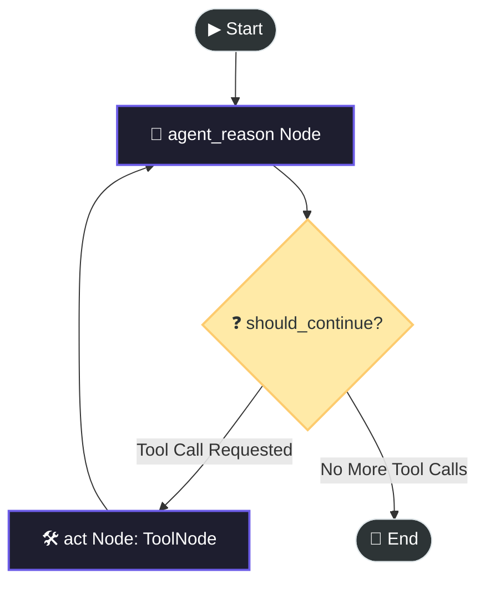

# 🤖 ReAct Function Calling with LangGraph

[](https://www.python.org/)
[](https://github.com/langchain-ai/langgraph)
[](https://openrouter.ai/)
[](https://tavily.com/)

A premium, stateful implementation of the **ReAct (Reasoning and Acting)** agent pattern constructed using **LangGraph**, **LangChain**, and **OpenRouter** (leveraging the powerful `nvidia/nemotron-3-nano-omni-30b-a3b-reasoning` model).

This project demonstrates how an agent can dynamically decide when to search the web, execute custom Python mathematical functions, and reason about the gathered information to deliver highly accurate answers.

---

## 🗺️ Architecture Overview

The system is designed as a stateful, cyclic workflow graph. It starts at a reasoning node, queries the LLM, and decides dynamically whether to call external tools or terminate.



When you run the application, LangGraph automatically visualizes and saves the latest topological layout of this workflow graph to [graph.png](file:///home/vk1033/ReAct-Function-Calling-LangGraph/graph.png).

---

## ✨ Core Features

*   **Stateful Reasoning Loop**: Leverages LangGraph's `MessagesState` to implement an append-only thread of conversation history.
*   **Dual-Tool Integration**:
    *   🔍 **Web Search**: Dynamic real-world searching powered by [Tavily Search](https://tavily.com/).
    *   🧮 **Custom Calculations**: A custom mathematical Python tool (`triple`) to showcase arbitrary code execution capabilities inside the graph.
*   **Next-Gen LLM**: Connects to the **Nvidia Nemotron Omni** model via **OpenRouter** for advanced reasoning steps.
*   **Visual Topography Export**: Renders and saves the execution graph flow dynamically upon compilation.
*   **Clean Architecture**: Separation of concerns between graph initialization, state nodes, and tool wrappers.

---

## 📂 Project Structure

The project has a modular, 3-tier codebase:

*   📂 **[react.py](file:///home/vk1033/ReAct-Function-Calling-LangGraph/react.py)**: Initializes the foundational client configurations, declares the customized Python mathematical tool (`triple`), and binds the tool definitions to the LLM.
*   📂 **[nodes.py](file:///home/vk1033/ReAct-Function-Calling-LangGraph/nodes.py)**: Houses the graph node executors. Defines the `run_agent_reasoning` controller node and prepares the prebuilt `ToolNode` with bound tools.
*   📂 **[main.py](file:///home/vk1033/ReAct-Function-Calling-LangGraph/main.py)**: Orchestrates the graph setup, builds conditional edges, compiles the application, saves the Mermaid diagram visualization to [graph.png](file:///home/vk1033/ReAct-Function-Calling-LangGraph/graph.png), and boots up the demo query runtime.

---

## 🛠️ Setup & Installation

This project utilizes `uv` for lightning-fast virtual environment and dependency management.

### 1. Prerequisites
Ensure you have **Python 3.12+** installed on your system.

### 2. Clone the Project
```bash
git clone <your-repo-url>
cd ReAct-Function-Calling-LangGraph
```

### 3. Install Dependencies
Using `uv` (recommended):
```bash
# This will automatically create a virtual environment and sync the dependencies
uv sync
```
Or using standard `pip`:
```bash
pip install -r pyproject.toml
```

### 4. Configure Environment Variables
Copy the provided `.env.example` file and fill in your API keys:
```bash
cp .env.example .env
```
Open `.env` and enter your credentials:
```env
# OpenRouter API Key for ChatOpenRouter model
OPENROUTER_API_KEY=your_openrouter_api_key_here

# Tavily API Key for TavilySearch tool
TAVILY_API_KEY=your_tavily_api_key_here
```

---

## 🚀 Execution & Demo

To execute the demo agent, run `main.py` using `uv` or your active virtual environment:

```bash
uv run main.py
```
Or:
```bash
.venv/bin/python main.py
```

### 📝 Example Walkthrough

When triggered with the complex query:
> *"What is the temperature in Tokyo right now? List it and then triple it"*

The agent processes the solution sequentially:

1.  **Reasoning (`agent_reason`)**: The agent analyzes the question and realizes it does not know the current temperature of Tokyo. It issues a tool call command to `TavilySearch` for `"Tokyo current temperature"`.
2.  **Execution (`act`)**: LangGraph routes control to the `ToolNode`. The Tavily Search tool executes and retrieves the weather (e.g., `18.5 °C`).
3.  **Reasoning (`agent_reason`)**: The agent observes the temperature output, and registers that the user also wants to triple it. It launches a tool call to the custom Python function `triple(18.5)`.
4.  **Execution (`act`)**: The `triple` tool runs, returning `55.5`.
5.  **Reasoning & Final Response**: The agent receives `55.5`, synthesizes the complete context, and outputs the final response:
    > "The temperature in Tokyo right now is 18.5°C. When tripled, it is 55.5°C."

---

## 🛡️ Secure Coding Standards

This codebase is built to follow strict secure coding practices, ensuring safe runtime execution:
*   **Environment Confidentiality**: All API keys are loaded asynchronously from `.env` utilizing `python-dotenv`. Credentials are never hardcoded inside files.
*   **State Separation**: The graph executes in a stateless sandbox style, appending updates to `MessagesState` without leaking system variables.
